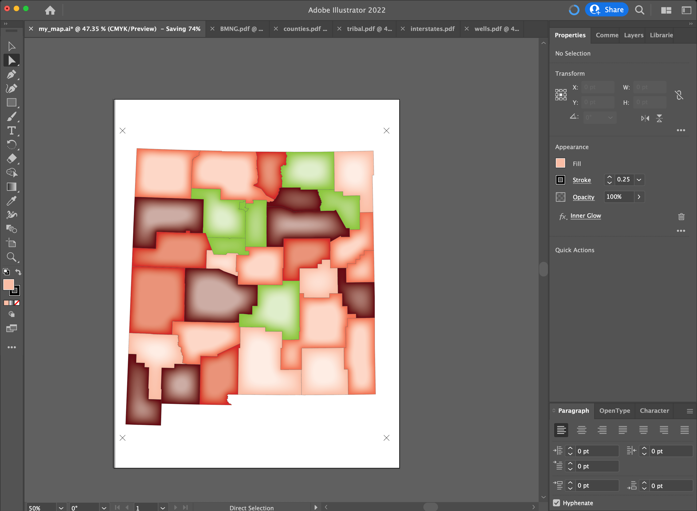

# Demonstration and Practice

Core Concepts:
 - Style vector elements to enable group selection based on stroke and fill properties within Illustrator
 - Include registration points in the layers to be exported to enable alignment with other layers
 - Export single graphic components as PDF files from the QGIS Layout Tool
 - Open exported PDF file in Illustrator
 - Select features from imported PDF file and copy into new layer in composite Illustrator file

Process

1. Create an empty Illustrator document that the GIS-generated layers will be added to. 

If you like you can install the [Brewer color palette](http://mkweb.bcgsc.ca/brewer/) that I will be using. Otherwise you can use whatever colors you like within the existing suite of Illustrator palettes. 

1. Single "layer" styling and transfer

	1. QGIS - demo of raster layer (statewide satellite image) selection and export
	1. QGIS - demo of vector layer (counties) import - basic styling of features - export of PDF version of styled features		
	2. Illustrator - opening of PDF file - copying, pasting and aligning separate feature collections

Repeated process for Tribal Lands, New Mexico interstates, and well locations. 

2. Selection and styling of features in Illustrator

	1. Polygon selection and styling
	2. Line selection and styling
	3. Point selection and styling

Similar process for selecting and styling line and point features. 

 
4. Addition of other cartographic elements

	1. QGIS - add feature labels - demonstrate layout mode for adding legend, map scale, north arrow - export PDF
	2. Illustrator - open PDF - modify existing cartographic elements - create new elements based on the elements generated by the GIS - custom feature labels using text tools - highlighting areas of interest - other annotations

